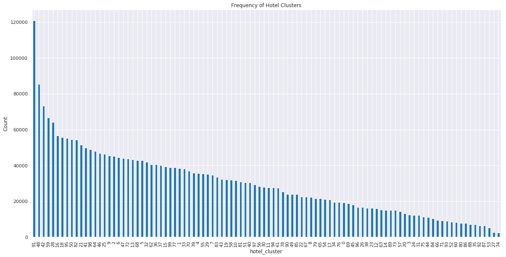
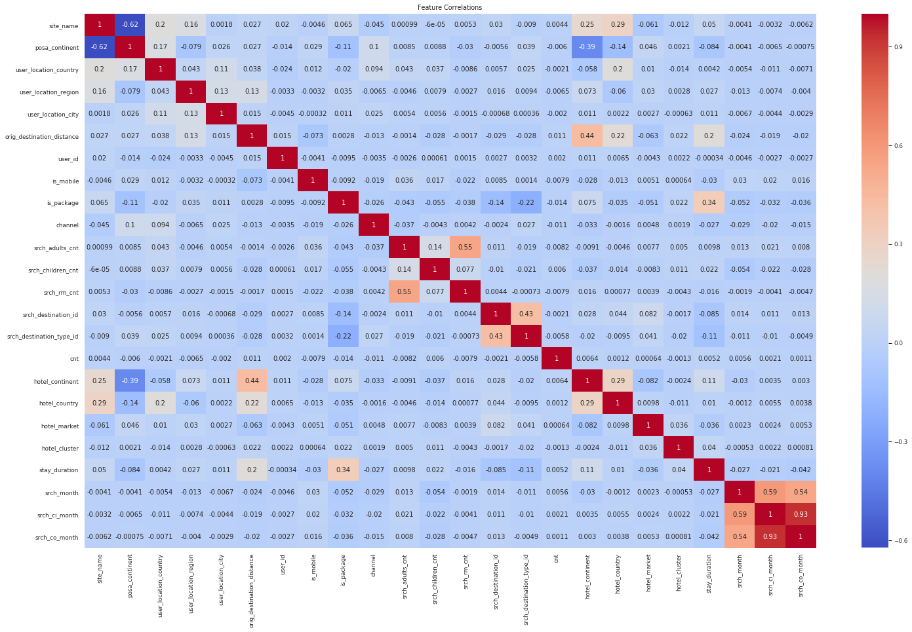
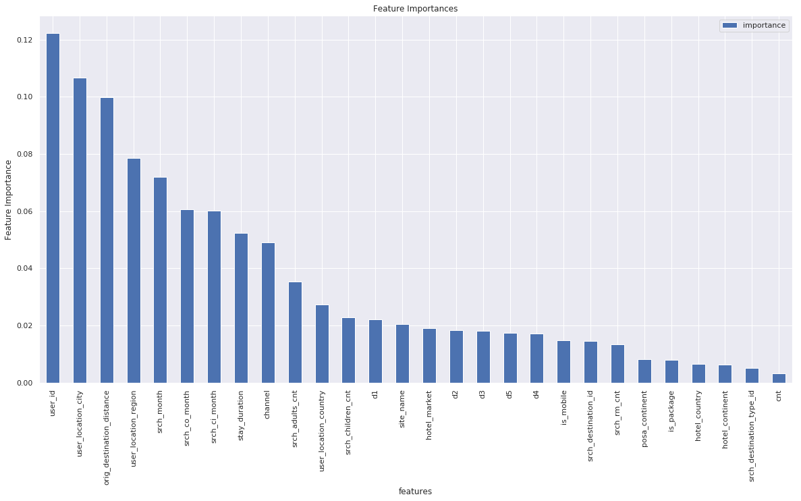
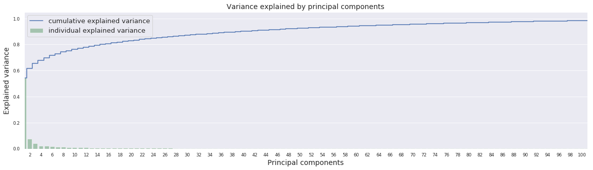

# 1. Definition

## 1.1 Project Overview
Planning a vacation can be an overwhelming affair with so many hotels to choose from at every destination. While booking a hotel online, there are always questions in our mind about whether the hotel would be as per our liking, should we explore a new hotel or stick to the one we usually stay in. 

Expedia wanted to solve this problem by providing personalized hotel recommendations to their users. Currently, Expedia uses search parameters to adjust their hotel recommendations, but there aren't enough customer specific data to personalize them for each user^1^.

In this project, we use Expedia's dataset of customer searches to create a recommendation system for hotel groups. Recommendation systems have been in use across various domains in e-commerce. They attained fame and popularity with the Netflix Prize which was a competition to build a movie recommendation system.

## 1.2 Problem Statement

Expedia has in-house algorithms to form hotel clusters, where similar hotels for a search (based on historical price, customer star ratings, geographical locations relative to city center, etc) are grouped together. These hotel clusters serve as good identifiers to which types of hotels people are going to book.

The goal of this project is to use Expedia's hotel search dataset to predict and recommend five hotel clusters that a customer is likely to book from 100 different hotel clusters, based on their search and other attributes associated with that user event.

Supervised Learning will be used to solve this problem. The approach for this would involve the following as part of the Machine Learning Pipeline:

1.	**Acquiring data and installing required software packages**
2.	**Exploratory Data Analysis and Visualization**

The dataset would be studied by obtaining the descriptive statistics and visualized to create an intuition about the data.

3.	**Data Cleaning and Preprocessing**

    * Dimensionality Reduction with Feature Selection and Principal Component Analysis would be done to select a subset of relevant features 
    * Removing or filling empty values

4.	**Establishing a Training and Testing pipeline**
    * Defining an Evaluation Metric and a Benchmark Model
    * Evaluating the performance of several Supervised Learning models against the Benchmark Model
    * Tuning the models' hyperparameters and reevaluating the models
    * Picking the best model based on tuned performance 

## 1.3 Metrics

Mean Average Precision was used as the evaluation metric. This was the metric which Expedia used to evaluate the solutions on Kaggle. Mean Average Precision @ 5 would be a good evaluation metric since we predict 5 hotel clusters for each user event.

$MAP@5 = \frac{1}{|U|} \sum_{u=1}^{|U|} \sum_{k=1}^{min(5, n)} P(k)$

where |U| is the number of user events, P(k) is the precision at cutoff k, n is the number of predicted hotel clusters. 

To elaborate further, Precision is the proportion of positive identifications which are actually correct. 

$Precision = \frac{True\ Positives}{True\ Positives\ +\ False\ Positives}$

In hotel cluster prediction, we want a measure of how many hotel clusters identified for a customer's search are actually correct. 

# 2. Analysis

## 2.1 Data Exploration

The dataset is a random selection of customer data from Expedia obtained from Kaggle. The data is split into two, a training set which contains 37,670,293 samples and 24 features, and a test set contains 2,528,243 samples and 22 features. The test set does not contain click events and hotel clusters. The user IDs present in the test dataset are a subset of the ones in the training dataset. Also, the training data is from 2013 and 2014, while test data is from 2015.

There is also a dataset with destination information with 150 latent features. 

The description of the features of the training dataset is in [@tbl:training_dataset].

--------------------------------------------------------------------------------------------------------------------------------------------------------------------------------------------------------------------------
Feature                                                 Description
------------------------------------------------------  ------------------------------------------------------------------------------------------------------------------------------------------------------------------
date_time                                               Timestamp

site_name                                               ID of the Expedia point of sale (i.e. Expedia.com, Expedia.co.uk, Expedia.co.jp, ...)

posa_continent                                          ID of continent associated with site_name 

user_location_country                                   The ID of the country the customer is located 

user_location_regionThe                                 ID of the region the customer is located

user_location_city                                      The ID of the city the customer is located

orig_destination_distance                               Physical distance between a hotel and a customer at the time of search. A null means the distance could not be calculated

user_id                                                 ID of user

is_mobile                                               1 when a user connected from a mobile device, 0 otherwise

is_package                                              1 if the click/booking was generated as a part of a package (i.e. combined with a flight), 0 otherwise

channel                                                 ID of a marketing channel

srch_ci                                                 Checkin date

srch_co                                                 Checkout date

srch_adults_cnt                                         The number of adults specified in the hotel room

srch_children_cnt                                       The number of (extra occupancy) children specified in the hotel room

srch_rm_cnt                                             The number of hotel rooms specified in the search

srch_destination_id                                     ID of the destination where the hotel search was performed

srch_destination_type_id                                Type of destination

hotel_continent                                         Hotel continent

hotel_country                                           Hotel country

hotel_market                                            Hotel market

is_booking                                              1 if a booking, 0 if a click

cnt                                                     Number of similar events in the context of the same user session

hotel_cluster                                           ID of hotel cluster

------------------------------------------------------  ------------

: Description of features in training dataset {#tbl:training_dataset}

Except for _date\_time_, _srch\_ci_ and _srch\_co_, rest have numerical values. These three have datatime values. 

The has _orig\_destination\_distance_ feature has 1,015,179 null values. Rest of the features do not have any null values. 

--------------------------------------------------------------------------------------------------------------------------------------------------------------------------------------------------------------------------
Feature                                                 Description
------------------------------------------------------  ------------------------------------------------------------------------------------------------------------------------------------------------------------------
srch_destination_id                                     ID of the destination where the hotel search was performed

d1-d149 									                   Latent description of search regions

------------------------------------------------------  ------------

: Description of features in destinations dataset {#tbl:destinations_dataset}

[@tbl:destinations_dataset] shows the description of the features in the destinations dataset. These features are latent features since they are features extracted from hotel reviews text. 

## 2.2 Exploratory Visualization

Since we are only concerned about hotel bookings, we eliminate samples for clicks before visualizing the data. This is discussed further in section [3](#methodology).

_hotel\_clusters_ is the outcome we are trying to predict. In [@fig:cluster_counts], we can see that the frequency of occurrence of hotel clusters in the dataset is not uniformly distributed. A few of the hotel clusters occur more than others. 

{#fig:cluster_counts}  

After some feature engineering, which is described in section [3.1](#data-preprocessing), Pearson Correlation was plotted as a heatmap shown in [@fig:heatmap]. 

{#fig:heatmap}  

From the figure we can observe that there isn't much of a linear correlation between _hotel\_cluster_ and other features. 

## 2.3 Algorithms and Techniques

The problem we are trying to solve is a multiclass classification problem since there are 100 different hotel clusters (classes) and the top 5 hotel clusters are predicted for a customer search. Each outcome is of 5 classes. Also, the problem is non-linear as seen in [@fig:heatmap]. 

The performance of different supervised learning algorithms which satisfy the aforementioned conditions were evaluated.

1. Naive Bayes
2. Decision Trees
3. Tree Based Ensemble Methods
      i. Random Forests
      ii. Extremely Randomized Trees
      iii. Extreme Gradient Boosted Trees (XGBoost)

All of these algorithms will predict the probability for each of the classes (hotel clusters), since we want the 5 mostly likely hotel clusters to suggest to the user. The default parameters are used for all the algorithm prior to tuning. 

We'll look at these algorithms in more detail. 

**Naive Bayes**

Naive Bayes methods are a set of supervised learning algorithms based on applying Bayes’ theorem with the “naive” assumption of conditional independence between every pair of features given the value of the class variable^2^. The Bernoulli variant of Naive Bayes is used since each hotel cluster can be taken to present or absent for a customer search record. 

**Decision Trees**

In a Decision Tree, the data is split by asking questions based on the input variables at each node. The branches represent the various possible outcomes. The leaves represent classes in which the data can be classified. Traversing this tree leads us to the correct classification of the input data. 

This makes it an ideal candidate for classification problems. 

**Random Forests**

Random Forests are an ensemble learning method where multiple Decision Trees are trained. This results in a better predictive performance. 

**Extremely Randomized Trees**

Extremely Randomized Trees are a variant of Random Forests where when choosing variables at a split, samples are drawn from the entire training set instead of a bootstrap sample of the training set and splits are chosen completely at random from the range of values in the sample at each split^3^.

Since this is also a tree based ensemble method, this is included to boost performance. 

**XGBoost**

XGBoost which stands for "Extreme Gradient Boosting" is an implementation of gradient boosted decision trees designed for speed and performance that is dominative competitive machine learning^4^. 

## 2.4 Benchmark

A naïve predictor which would always return the top five most frequently occurring hotel clusters was used as the Benchmark Model. 

From Figure 1, the top 5 hotel clusters are 91, 48, 42, 59 and 28. The MAP@5 score for a predictor which always returns these 5 is 0.0337. The models implemented were compared to this benchmark. 

# 3. Methodology

## 3.1 Data Preprocessing

**Subsampling** 

There are 37,670,293 records in the main dataset we will be using. Since this is a very large data and since the models were trained on a machine with limited resources, the dataset was reduced by selecting a subsample of it. 

The samples in the training dataset contains both click and booking events. Since only booking events are of concern, all rows for click event were removed. 

Then, 15,000 user IDs were selected at random and only the samples for these user IDs were retained. This reduced the total number of samples to around 50,000.  

**Feature Engineering**

The categorical features were already encoded as numeric and required no change. Datetime features like _date\_time_, _search\_ci_. _search\_co_ were converted into months of the year to account for seasonal variability. A new feature _stay\_duraton_ was added which is the number of days between check-in and check-out. 

**Dimensionality Reduction**

The destinations dataset contains 149 latent features. Since is a large feature space, Principal Component Analysis was used to reduce the dimensionality. The values of these features were first scaled using a min-max scaler. On doing PCA, it was found that ~70% variance in the data was explained by the first 5 principal components. These 5 principal components were then merged along with the training dataset on _src\_destination\_id_. 

Using the Random Forest Classifier, feature importances we obtained on this dataset as seen in [@fig:feature_imp]. The least important feature _cnt_ was dropped from the dataset in an attempt to further reduce the feature space. 

**Data Cleaning**

Since _orig\_destination\_distance_ feature several null values, they were replaced with the mean of the non-null values of that feature. This was preferred to deleting the null rows since that resulted in the loss of a lot of data. 

## 3.2 Implementation

Due to the large size of the dataset, only a subsample of the data was used. This is discussed in section [3.1](#data-preprocessing). Training and testing were done on this data itself. The test dataset provided by Kaggle could not be used since the _hotel\_cluster_ which is the target variable is missing in it. The performance of our models on that dataset can be seen only if a solution is submitted to Kaggle. For the purpose of this project, only the training dataset was used and no submission was made to Kaggle. 

Supervised learning algorithms from section [2.3](#algorithms-and-techniques) were implemented using [scikit-learn](https://scikit-learn.org/) library.

Implementation of the solution involved the following steps: 

1. After preprocessing the data as mentioned in section [3.1](#data-preprocessing), models were trained
2. Each scikit-learn models were trained using the default parameters 
3. K-Fold cross-validation with k = 3 was used with MAP@5 as the scoring metric. This was done using a custom scorer to produce MAP@5 scores instead of using built-in scorers for accuracy or precision scores.
4. Time taken for the k-fold cross-validation was measured

## 3.3 Refinement

The results obtained by training the models with the default parameters is shown in [@tbl:model_perf_comparison]. It is seen that XGBoost has the best score, followed by Random Forest and Extra Trees Classifiers, both of which have similar scores. XGBoost took the most time. 

------------------------------------------------------
Classifier                Mean MAP@5    Time taken (s)
------------------------  ------------  --------------
BernoulliNB               0.129953      3.43

DecisionTreeClassifier    0.091675      5.85

RandomForestClassifier	   0.163944      6.04

ExtraTreesClassifier      0.162135      5.07

XGBClassifier             0.218270      914.93

------------------------  ------------  --------------

: Comparison of model performance {#tbl:model_perf_comparison}

The hyperparameters were then tuned using Grid Search. For Decision Tree, Random Forrest and Extremely Randomized Trees, `min_samples_leaf` and `min_samples_split` were tuned. For XGBoost, `max_depth` and `colsample_bytree` were tuned. 

The tuning was done on a dataset got by splitting our reduced training dataset into a training and test set with 80% data in the training set. This was done because grid search for XGBoost was taking too long. Further reducing the dataset size helped keep its time under half an hour. 

From the Grid Search, for XGBoost, `colsample_bytree` value of 0.3 and `max_depth` value of 6 resulted in the best scores. For the other tree based classifiers, `min_samples_leaf` value of 5 and `min_samples_split` value of 2 resulted in best scores. 

The models were retrained with these hyperparameters and improved scores were obtained as shown in [@tbl:model_perf_comparison_tuned]. 

------------------------------------------------------
Classifier                Mean MAP@5    Time taken (s)
------------------------  ------------  --------------
BernoulliNB               0.129953      3.24

DecisionTreeClassifier    0.139452      4.77

RandomForestClassifier	   0.225363      7.94

ExtraTreesClassifier      0.225744      7.02

XGBClassifier             0.225798      1235.90

------------------------  ------------  --------------

: Comparison of model performance after tuning {#tbl:model_perf_comparison_tuned}

After tuning, the performance of Random Forests and Extremely Randomized Trees equalled that of XGBoost, yet the time taken was far less. 

Grid search was done on these two classifiers to further tune the hyperparameters. This yielded the hyperparameter values of 13 for `max_depth`, 5 for `min_samples_leaf`, 2 for `min_samples_split` and 131 for `n_estimators` for Extremely Randomized Trees. For Random Forests, the best score was from values of 29 for `max_depth`, 5 for `min_samples_leaf`, 2 for `min_samples_split` and 131 for `n_estimators`.The best scores of Random Forests (0.193) was slightly better than the best score for Extremely Randomized Trees (0.191). 

# 4. Results

## 4.1 Model Evaluation and Validation

Based on the refinement discussed in section [3.3](#refinement), Random Forest Classifier with the tuned hyperparameters was chosen as the final model. The MAP@5 score on the reduced dataset trained using this model is shown in [@tbl:final_model_perf_reduced]. To recollect, the reduced dataset was formed by randomly picking 15,000 user IDs and retaining the records for those, which resulted in around 50,000 records.

------------------------------------------------------
Classifier                Mean MAP@5    Time taken (s)
------------------------  ------------  --------------
RandomForestClassifier	   0.228299      9.80

------------------------  ------------  --------------

: Performance of Random Forest Classifier on reduced dataset after final tuning {#tbl:final_model_perf_reduced}

Since this classifier is relatively fast, the whole dataset was used to obtain the scores shown in [@tbl:final_model_perf_full].

------------------------------------------------------
Classifier                Mean MAP@5    Time taken (s)
------------------------  ------------  --------------
RandomForestClassifier	   0.330557      1806.65

------------------------  ------------  --------------

: Performance of Random Forest Classifier on full dataset after final tuning {#tbl:final_model_perf_full}

This model can be considered robust since the scores were obtained using 3-fold cross-validation, where the model is trained on different data splits, which minimizes overfitting. We can be confident that this model would perform well on unseen data. 

## 4.2 Justification

The benchmark model we used was a naïve predictor which would always return the top five most frequently occurring hotel clusters. The MAP@5 score of this model was `0.0337`. Our final model with a score of `0.331` did better than this naïve model. Hence, our model can be considered as having solved this problem. 

The leaderboard on Kaggle has solutions with scores of around 0.5 but these were obtained by exploiting a data leak by aggregating _hotel\_cluster_ based on _orig\_destination\_distance_^5^. Our model does relatively well without exploiting data leaks. 

# 5. Conclusion

## 5.1 Free-Form Visualization

During Dimensionality Reduction, Random Forest Classifier was used to get the feature importances. This is shown in [@fig:feature_imp]. This gives us an insight on the top features which result in a better prediction.

{#fig:feature_imp} 

Since the destinations dataset contained 149 latest features, they were reduced using PCA. The plot in [@fig:pca_top_components] shows the individual and cumulative explained variance of the principal components. Based on this, 5 components were picked. 

{#fig:pca_top_components} 

## 5.2 Reflection

The process used in this project is summarized in the following steps:

1. Data acquisition: Since this was from a Kaggle competition, data acquisition step was easy.
2. Understanding the data: Did exploratory analysis by looking at the feature values and used. visualization as an aid. All the three datasets provided by Kaggle were looked at. 
3. Data preprocessing: Cleaned the data by taking care of null values, reducing the dimensions of the data from the destinations dataset and merging it with the training dataset.
4. Feature engineering: Features with datetime values were converted into numeric values. 
5. Selecting the algorithms: Based on the problem statement and correlation of the features with the target variable, the algorithms to be used were selected. 
6. Evaluating algorithm performance: Trained and tested the algorithms on the dataset to determine the metric score.
7. Hyperparameter tuning: Used grid search cross validation to determine the hyperparameters giving the best score. 
8. Final model: Compared the score of the models after tuning and picked one by making a trade off between the metric score and train/test time. 

An aspect of the project which caused some difficulty was the size of the dataset. When the whole dataset was used, the training time for algorithms like XGBoost ran into several hours. Hence, I had to use a reduced dataset while training the different models to keep the time under reasonable limits. 

Tuned Random Forest Classifier had a score better than untuned XGBoost. Also the time taken for cross validation on the reduced dataset was in seconds compared to minutes in XGBoost. Hence, our model can be used in a general setting like Expedia's booking website to make hotel suggestions purely based on the user's search parameters. 

## 5.3 Improvement

The model developed in this project has scope for improvements. Better tuning of the hyperparameters might lead to better metric scores. Two rounds of hyperparameter tuning were done with more hyperparameters in the successive rounds. This gave the hyperparameters which resulted in an improved score. Hence, more tuning could be done for further performance gains. The only constraint here is the time it would take to cross-validate the different parameter combinations in grid search. 

Kaggle solutions with higher scores without exploiting the data leak were got using XGBoost. This algorithm performed better than other algorithms prior to hyperparameter tuning. Since grid search for this took a long time, further tuning was abandoned. Using a more powerful machine could mitigate this to an extent. Also a randomized search could be used instead of a grid search to get results faster but the trade off would be on the quality of the parameters chosen from it.  

Also, Deep Neural Networks with a GPU based TensorFlow backend could be used for the classification task in this project. Lack of access to a machine with GPU and better resources prevented its use in this project.

With these improvements, the score could be pushed close to the leakage score. 

# 6. References

[1] “Which Hotel Type Will an Expedia Customer Book?” Expedia Hotel Recommendations, [www.kaggle.com/c/expedia-hotel-recommendations](www.kaggle.com/c/expedia-hotel-recommendations).

[2] “Naive Bayes.” Scikit-Learn 0.19.2 Documentation, [scikit-learn.org/stable/modules/naive_bayes.html](scikit-learn.org/stable/modules/naive_bayes.html).

[3] “RandomForestClassifier vs ExtraTreesClassifier in Scikit Learn.” Stack Overflow, [stackoverflow.com/questions/22409855/randomforestclassifier-vs-extratreesclassifier-in-scikit-learn](stackoverflow.com/questions/22409855/randomforestclassifier-vs-extratreesclassifier-in-scikit-learn).

[4] “How to Develop Your First XGBoost Model in Python with Scikit-Learn.” Machine Learning Mastery, 8 Apr. 2018, [machinelearningmastery.com/develop-first-xgboost-model-python-scikit-learn/](machinelearningmastery.com/develop-first-xgboost-model-python-scikit-learn/).

[5] Paruchuri, Vik. “Place in the Top 15 of Kaggle's Expedia Competition.” Dataquest, Dataquest, 15 Dec. 2017, [www.dataquest.io/blog/kaggle-tutorial/](www.dataquest.io/blog/kaggle-tutorial/).