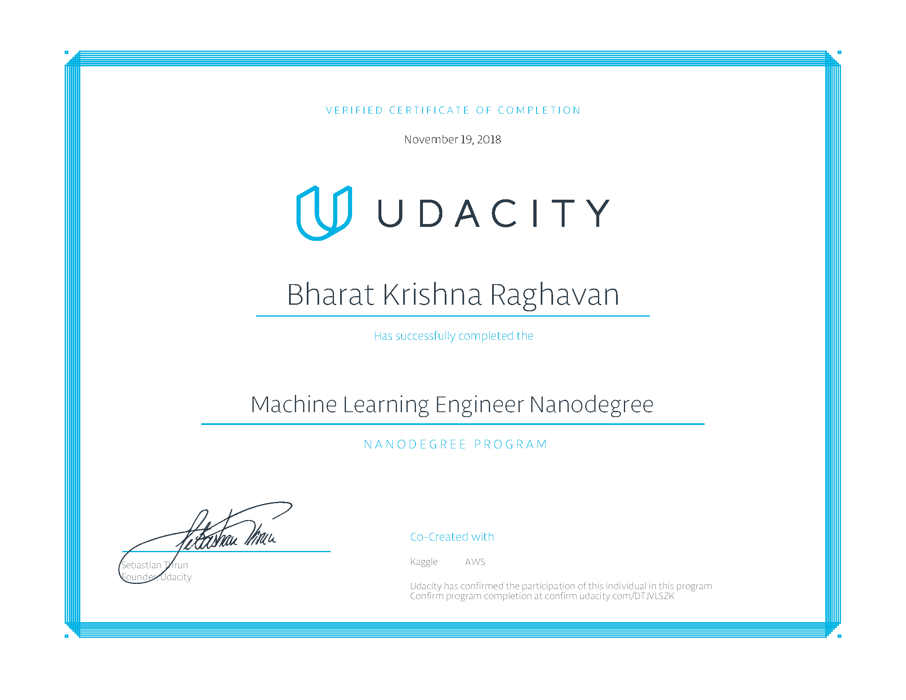

# Machine Learning Engineer Nanodegree

Certificate Confirmation: [https://confirm.udacity.com/DTJVLSZK](https://confirm.udacity.com/DTJVLSZK)

## Projects
### Model Evaluation and Validation
[Predicting Boston Housing Prices](Predicting-Boston-Housing-Prices/boston_housing.ipynb)

### Supervised Learning
[Finding Donors for CharityML](Finding-Donors-for-CharityML/finding_donors.ipynb)

### Unsupervised Learning
[Creating Customer Segments](Creating-Customer-Segments/customer_segments.ipynb)

### Deep Learning
[Dog Breed Classifier](Dog-Breed-Classifier/dog_app.ipynb)

### Reinforcement Learning
[Train a Quadcopter How to Fly](Teach-a-Quadcopter-How-to-Fly/Quadcopter_Project.ipynb)

### Capstone Project
Expedia Hotel Recommendations

* [Notebook](Capstone-Project/Capstone Project.ipynb)
* [Report](Capstone-Project/project_report.pdf)